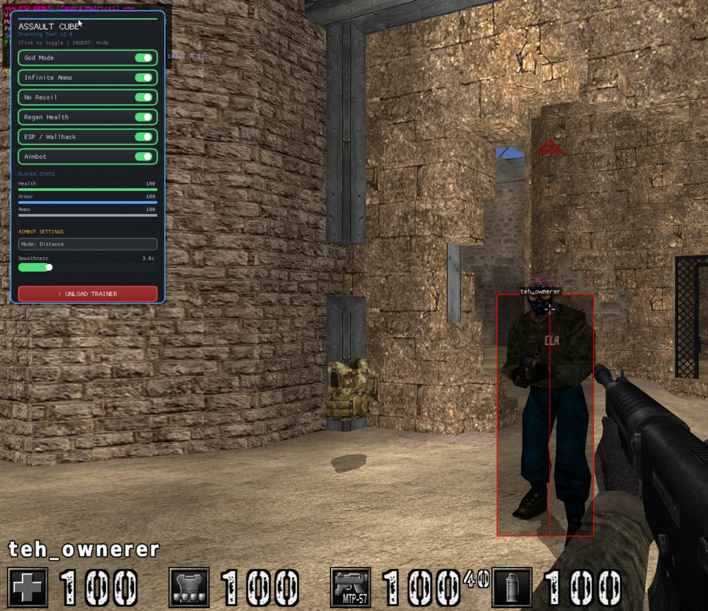

# Assault Cube Loader TUI

A Tui loader bundled with a DLL trainer. The loader is written in Go with MySQL persistence(disabled by default), while the `trainer/` directory contains the C++ game trainer that is injected once the game launches successfully.

## Key Features

### Loader (Go)
- Account lifecycle: register, log in, and reset passwords against the `users` table with bcrypt hashing for storage and comparisons.
- Post-login dashboard that keeps track of the signed-in user and routes to game actions or logout.【F:views/dashboard.go†L1-L120】
- Assault Cube discovery, checksum validation, and DLL injection that wraps Windows process launching utilities from the `injection` package.
- Shared Lipgloss styling for a consistent terminal experience with keyboard-driven navigation across views.【

### Trainer (C++)
- Hook library (`actrainer.dll`) with toggles for God Mode, Infinite Ammo, No Recoil, and other actions triggered by in-game hotkeys.
- Build scripts and CMake configuration for compiling the DLL on Windows before placing it at `trainer/actrainer.dll` for the loader to inject.


### Trainer ESP & Offsets
- ESP rendering, hotkeys, and feature toggles: [`trainer/README.md`](trainer/README.md)
- Memory layouts, matrices, and player offsets backing the overlay: [`trainer/ac_offsets.md`](trainer/ac_offsets.md)
- Injection workflow and quick commands: [`INJECTION_GUIDE.md`](INJECTION_GUIDE.md) and [`QUICK_REFERENCE.md`](QUICK_REFERENCE.md)



## Project Layout

```
tuiapp/
├── main.go               # Bubble Tea program orchestration
├── config.go             # appsettings.json loader and DSN builder
├── db.go                 # MySQL connection pool management
├── appsettings.example.json
├── views/                # Individual TUI screens
│   ├── menu.go
│   ├── login.go
│   ├── register.go
│   ├── dashboard.go
│   ├── loadassaultcube.go
│   ├── resetpassword.go
│   └── styles.go
├── injection/            # Windows process launch & DLL injection helpers
├── trainer/              # C++ trainer source and build scripts
├── tools/                # Utility Go programs (checksum helper, etc.)
└── profile/              # Runtime logs and diagnostics
```

## Prerequisites

### Loader
- Go 1.25+ (module target shown in `go.mod`).【
- MySQL 8.0+ with a database the loader can connect to.
- Terminal that supports ANSI colors.
- Windows is required for the injection flow because the launcher relies on Win32 APIs; other platforms can still run the TUI for development.

### Trainer
- Windows with Visual Studio 2019/2022 and CMake 3.15+ to build the DLL.

## Database Setup

Create the schema and table expected by the loader:

```sql
CREATE DATABASE tuiapp;
USE tuiapp;

CREATE TABLE users (
    id INT AUTO_INCREMENT PRIMARY KEY,
    username VARCHAR(255) NOT NULL UNIQUE,
    password_hash VARCHAR(255) NOT NULL,
    created_at TIMESTAMP DEFAULT CURRENT_TIMESTAMP
);
```

## Configuration

1. Copy the example settings and update them with your MySQL credentials:
   ```bash
   cp appsettings.example.json appsettings.json
   ```
2. Fill in the database section; the loader parses it through `LoadConfig` and builds a DSN with sensible defaults for timeouts.
3. Keep `appsettings.json` out of version control—only the example file is committed.

Example configuration:

```json
{
  "database": {
    "host": "127.0.0.1",
    "port": 3306,
    "user": "tuiapp",
    "password": "your_password",
    "database": "tuiapp"
  },
  "app": {
    "name": "TUI App",
    "version": "1.0.0"
  }
}
```

## Building the Trainer DLL

1. Open PowerShell in `trainer/` on Windows.
2. Build the DLL using the provided script or CMake commands:
   ```powershell
   .\build.ps1
   # or
   mkdir build
   cd build
   cmake .. -G "Visual Studio 17 2022" -A Win32
   cmake --build . --config Release
   ```
3. Copy the resulting `actrainer.dll` (found in `trainer/build/lib/Release/`) to `trainer/actrainer.dll`. The loader checks that path before launching the game.

### All-in-One Windows Build

When you want to compile everything and launch from a single command, run `build_all.ps1` from the project root in an elevated PowerShell session. The script verifies Visual Studio, builds the trainer, compiles the Go loader as a 32-bit executable.

## Running the Loader

```bash
go run .
# or build a binary
go build -o tuiapp
./tuiapp   # Linux/macOS development (no injection)
```

On Windows, run `tuiapp.exe` from a terminal. The program clears the console, loads configuration, opens the MySQL pool, and starts the Bubble Tea program.

## TUI Flow & Controls

### Global
- `q` or `Ctrl+C`: quit the application.
- `esc`: navigate backwards (logout from dashboard, return to menu, etc.).

### Menu
- Use arrow keys or `j/k` to move between **Login** and **Register**, `Enter` to select.

### Login & Register
- `Tab` / `Shift+Tab` / `Up` / `Down`: change focused field.
- `Enter`: submit when the button is focused. Errors are displayed inline if validation fails or credentials are wrong.

### Dashboard
- Choose **Load Assault Cube**, **Reset Password**, or **Logout** with arrow keys and `Enter`. Logging out clears session state before returning to the main menu.

### Load Assault Cube
- `Enter` or `l`: scan common installation paths for `ac_client.exe` and verify a SHA-256 checksum against `knownVersions`.
- `s`: launch the game and inject the trainer when a valid executable is found. Status, errors, and trainer hotkeys are rendered in the view.

### Reset Password
- `Tab` / `Shift+Tab` / arrow keys: switch between password inputs.
- `Enter`: submit the reset once the button is focused. The model validates the current password, enforces a minimum length, and writes the new hash back to MySQL.

### Customizing the Look & Feel
- Update the shared Lipgloss palette and widget styles in `views/styles.go` to tweak colors, borders, and focus/blur states for inputs and buttons across the entire interface.【F:views/styles.go†L1-L80】
- Adjust menu labels or navigation prompts by editing `views/menu.go`, which controls the initial screen and its keyboard bindings.

## Updating Known Game Versions

The loader ships with placeholder checksums. Use the checksum helper to add real versions:

```bash
cd tools
go run checksumtool.go "C:\\Path\\To\\ac_client.exe"
```

Copy the SHA-256 value into the `knownVersions` map near the top of `views/loadassaultcube.go`.

## Logs & Diagnostics

The loader prints connection attempts when initializing MySQL and will surface detailed errors if configuration or authentication fails, helping diagnose issues quickly.
## Legal Notice

This project is provided for educational use. Only inject the trainer into games you own, preferably offline or in controlled environments, and respect the terms of the game you are modifying.
